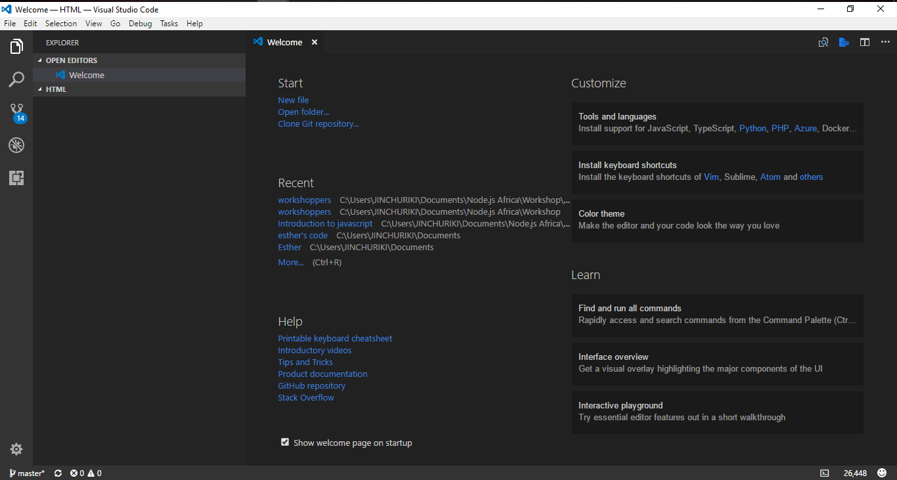
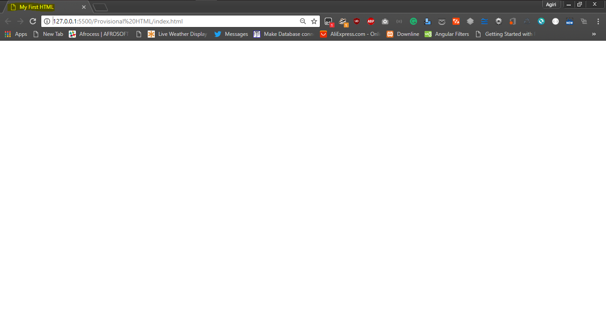

# Provisional HTML Crash Course

This course is not a comprehensive HTML course but something to get you started with JS. We strongly advice more research should be done, but also hope that end of this course you should be ready to write simple HTML and JS.

## Getting Started
- Install a code editor [Visual studio code VSC](https://code.visualstudio.com/Download) : A code editor is software or tool that helps you write clean codes, rather than using the regular notepad on your local machine.
- Making sure you have the latest version of chrome installed [Google Chrome](https://www.google.com/chrome/).
- Now you are all ready... Let's learn.

## Step 1:
**Good pratice: Make sure you create a folder to save your html projects**
- Open your code editor 
- Open the folder *using vs code: windows->  CTRL + O, mac -> CMD + O*
- Navigate to your project folder and click open 
- Your code editor should look like this 
- Click on file -> New File -> File name should be index.html

If you were able to complete this task, you deserve a Hi-Five! **Award: HTML Boss!**


## Step 2: Create the HTML file
Now you have a file named index.html, you might be probably thinking:
- What's next?
- What's HTML? 
- Why was the file named *'index'* not something other than that?

### What's HTML?
HTML stands for HyperText Markup Language, there is no web application or website that does not some html codes. Therefore, HTML is the building block of any application that runs in your browser from simple static webpages to dynamic pages.

HTML being a markup language, meaning it should have some sort of tags or elements marking or matching up to something, right? Yes! HTML has it's own elements and tag that are represented in the browser and rendered in different forms according to it's uses. Like:
`` that's an image tag, if a src is passed in, it renders an image on the browser but `<p></p>` can not render an image on the browser. 

Good! Now we understand that markups are elements that are represented in codes as tags and rendered in the browser based on their definition and uses.

### Why was the file named index.html
The browser looks up for the index, as the name simple means a search point. Think of it as human looking for a definition or word in a book or dictionary, it's eaiser to check the index page of the textbook or dictionary for the content you need, right? The browser performs in a similar manner it looks up the index as a seacrching point to render a webpage.

### What next?

## Step 3: Creating a boileplate
- Prepare a boilerplate 
- Typing `html:5` and clicking on 'CTRL + Spacebar + Enter' or 'CMD + Spacebar + Return' should give you something like this:
```
<!DOCTYPE html>
<html lang="en">
<head>
    <meta charset="UTF-8">
    <meta name="viewport" content="width=device-width, initial-scale=1.0">
    <meta http-equiv="X-UA-Compatible" content="ie=edge">
    <title>Document</title>
</head>
<body>
    
</body>
</html>
```

if that didn't happen copy and paste the code in your index.hmtl file.
*Don't bother with the meta tag for now, but know it's for page description*.

- Notice the `<!Doctype HTML>` at the top of the file? It tells the browser that the code in the this file an HTML5 code and it should use just HTML5 tag names and attributes.
- Next the `<head></head>` tag: The head tag holds meta data, things that can't been seen on the webpage but they exist. For now pay attention to the `<title></title>` tag that holds the title of the page.

## Step 4: Opening and serving the webpage
- How do we see what we've done so far in the browser.
- Right click on the index.html in vs code and click copy file path 
- Paste the file path in the URL search bar of your browser and click enter or return 

An empty page should be rendered, 
- Now open your code editor and try changing the content of the title tag to `<title>My First HTML</title>` hit save 'CTRL + S' or 'CMD + S'.
- Refresh the browser and see your changes 

- *NB:- Whenever you make a change in the html file always save and refresh to see your changes..*

## Step 5: More Tags
 

